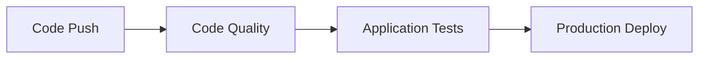

# GitHub Actions Workflows

This project uses GitHub Actions for automated CI/CD with a three-stage pipeline ensuring code quality, testing, and deployment.

## Workflow Overview



## Workflows

### 1. 🔍 Code Quality (`code-quality.yml`)

**Purpose**: Ensures code meets quality standards before testing

**Triggers**:
- Push to `main` or `develop` branches
- Pull requests to `main` branch
- Called by other workflows
- Manual dispatch

**Jobs**:
- **code-quality**: Runs all quality checks
  - Black formatting check
  - isort import sorting check
  - Flake8 linting
  - Bandit security scanning
  - MyPy type checking
  - Django system checks
  - Migration validation
  - Test execution with coverage

- **pre-commit**: Validates pre-commit hooks
  - Runs all configured hooks
  - Ensures commit standards

**Artifacts**:
- Coverage reports (uploaded to Codecov)
- Bandit security reports

### 2. 🧪 Application Tests (`test.yml`)

**Purpose**: Validates application functionality and deployment readiness

**Triggers**:
- Push to `main` or `develop` branches
- Pull requests to `main` branch
- Called by deploy workflow
- Manual dispatch

**Jobs**:
- **test**: Application testing
  - Builds Docker test image
  - Runs Django security checks
  - Tests static file collection
  - Validates deployment configuration
  - Tests application module imports

### 3. 🚀 Production Deploy (`deploy.yml`)

**Purpose**: Deploys application to production after quality checks pass

**Triggers**:
- Push to `main` branch only
- Manual dispatch

**Job Dependencies**:
```
deploy.yml
├── code-quality (calls code-quality.yml)
├── test (calls test.yml, needs: code-quality)
└── deploy (needs: [code-quality, test])
```

**Jobs**:
- **code-quality**: Calls code quality workflow
- **test**: Calls application test workflow (runs after code-quality)
- **deploy**: Deploys to production (runs after both pass)
  - SSH connection to EC2
  - Code deployment
  - Environment setup
  - Docker container management
  - Health checks

## Workflow Sequence

### On Push to `main`:
1. **Code Quality** checks run first
2. **Application Tests** run after quality checks pass
3. **Production Deploy** runs after both previous stages pass

### On Push to `develop` or PR:
1. **Code Quality** checks run
2. **Application Tests** run
3. No deployment (deploy workflow not triggered)

### Manual Triggers:
- Any workflow can be triggered manually via GitHub Actions UI
- Useful for debugging or emergency deployments

## Configuration Files

### Workflow Files
- `.github/workflows/code-quality.yml` - Code quality pipeline
- `.github/workflows/test.yml` - Application testing pipeline
- `.github/workflows/deploy.yml` - Production deployment pipeline

### Quality Configuration
- `pyproject.toml` - Tool configurations (Black, isort, pytest, etc.)
- `.flake8` - Linting rules
- `.pre-commit-config.yaml` - Pre-commit hooks

## Secrets Required

The deploy workflow requires these GitHub repository secrets:

```
EC2_HOST=your-ec2-ip-or-domain
EC2_USERNAME=ubuntu
EC2_PRIVATE_KEY=your-private-key-content
SECRET_KEY=your-django-secret-key
ALLOWED_HOSTS=your-domain.com,your-ec2-ip
CSRF_TRUSTED_ORIGINS=https://your-domain.com
DB_PASSWORD=your-secure-database-password
POSTGRES_DB=infiora
POSTGRES_USER=infiora
POSTGRES_PASSWORD=your-secure-database-password
```

## Status Badges

Add these to your README.md to show workflow status:

```markdown
[](https://github.com/your-username/infiora-backend/actions?query=workflow%3A%22Code+Quality%22)
[](https://github.com/your-username/infiora-backend/actions?query=workflow%3A%22Test+-+Application+Testing%22)
[](https://github.com/your-username/infiora-backend/actions?query=workflow%3A%22Deploy+-+Production+Deployment%22)
```

## Monitoring and Debugging

### Viewing Workflow Results
1. Go to **Actions** tab in your GitHub repository
2. Click on any workflow run to see detailed logs
3. Each job shows individual step results
4. Download artifacts for coverage reports and security scans

### Common Issues

#### Code Quality Failures
- Check formatting: `make format-check`
- Run linting: `make lint`
- Fix type errors: `make type-check`
- Review security issues: `make security-check`

#### Test Failures
- Review Docker build logs
- Check Django configuration
- Validate environment variables
- Test locally: `make test-coverage`

#### Deployment Failures
- Verify GitHub secrets are set correctly
- Check EC2 instance status and SSH access
- Review deployment logs in workflow
- Validate environment file creation

### Local Development

Run the same checks locally before pushing:

```bash
# Set up development environment
make dev-setup

# Run all quality checks
make quality

# Run tests
make test-coverage

# Check specific issues
make format-check
make lint
make type-check
make security-check
```

## Best Practices

1. **Always run quality checks locally** before pushing
2. **Use descriptive commit messages** for better workflow logs
3. **Review failed workflows** before force-pushing fixes
4. **Keep secrets updated** and secure
5. **Monitor deployment health** after successful deploys
6. **Use feature branches** for development work

## Troubleshooting

If workflows fail:

1. **Check the specific job that failed**
2. **Review the error logs** in GitHub Actions
3. **Run the same commands locally** to reproduce
4. **Fix issues and push again**
5. **Contact team if infrastructure issues persist**

The workflow system ensures that only high-quality, tested code reaches production while providing detailed feedback on any issues encountered.